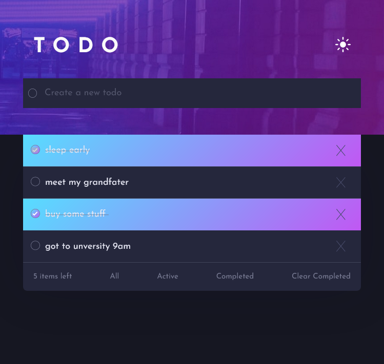

# Todo app solution

## Table of contents

- [Overview](#overview)
  - [The challenge](#the-challenge)
  - [Screenshot](#screenshot)
  - [Links](#links)
- [My process](#my-process)
  - [Built with](#built-with)
  - [What I learned](#what-i-learned)
  - [Continued development](#continued-development)
  - [Useful resources](#useful-resources)
- [Author](#author)
- [Acknowledgments](#acknowledgments)

**Note: Delete this note and update the table of contents based on what sections you keep.**

## Overview
- small tode app with alot of features 
- and organize todos well
- app has light/Dark theme
- Responsive with all different screen size
- has button help you to get focus todo you want to look
- soon i will add more feature to it 

### Screenshot

;

;
;
;

### Links

- Solution URL: [ solution URL ](https://your-solution-url.com)
- Live Site URL: [ live site URL ](https://your-live-site-url.com)

